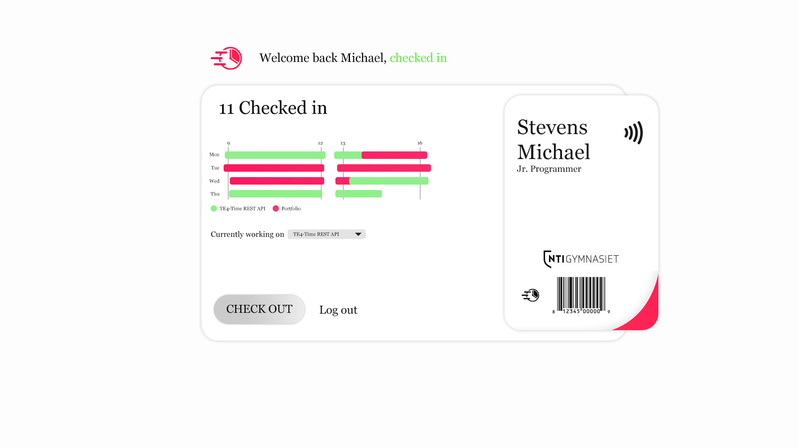

## T4-Time. Check-in system for the employes of TE4


TE4 Time tracker let's the employes of TE4 check in - and out of their shifts.

Users can login through Slack, visit the website and link their key cards.
The webserver also connects to check-in console (a Raspberry Pi) via the API



## API

Check-in and check-out

Path - http://te4.ygstr.com/api/check

Request: 
```json
{
    "card": "5f:46:ac:eb:75:a7:ea",
    "timestamp": 1567898719758,
    "id": "0",
    "token": "***********************************"
}
```

Response: 
```json
{
    "success": true,
    "check_in": false,
    "name": "Michael Stevens",
    "timestamp": 1567898719958
}
```


... more to come
